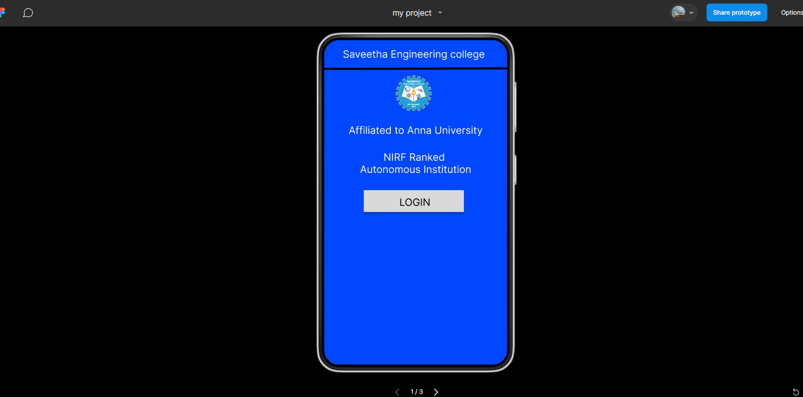
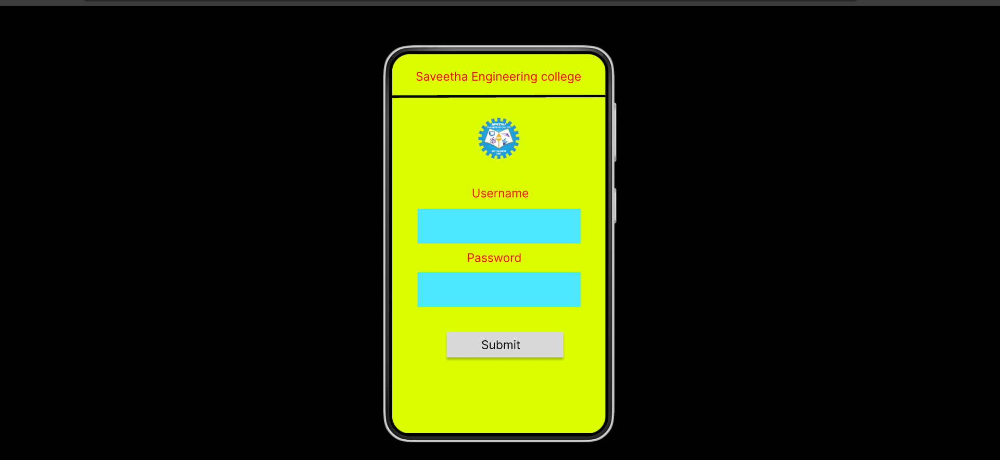
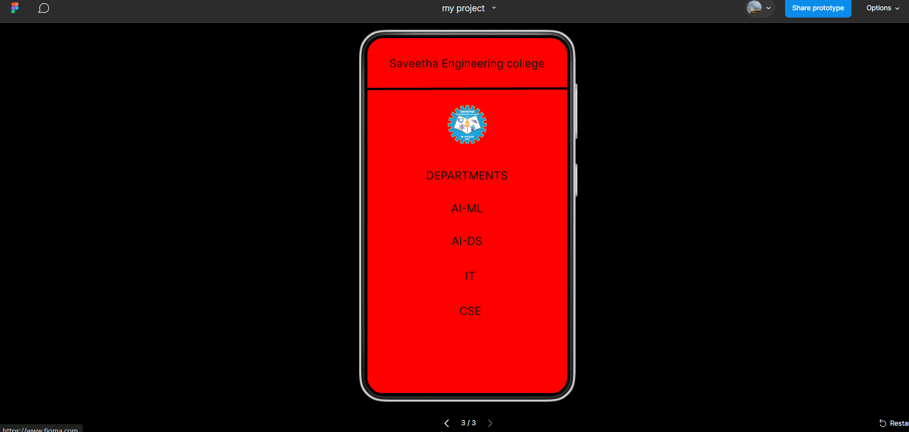

# Ex09 Event Registration Web Application
## Date:

## AIM:
To design, develop and deploy a web application for event registration.

## DESIGN STEPS:

### Step 1:
Create a new frame.

### Step 2:
Select any one preset size of your choice.

### Step 3:
Select the shapes you need.

### Step 4:
Import images as needed.

### Step 5:
Create pages based on your need and link them.

### Step 6:

Validate the HTML and CSS code.

### Step 6:

Publish the website in the given URL.

## DESIGN TOOL:
Figma

## CODE:
```
.home-page {
  background-color: #0047ff;
  display: flex;
  flex-direction: row;
  justify-content: center;
  width: 100%;
}

.home-page .div {
  background-color: #0047ff;
  height: 640px;
  position: relative;
  width: 360px;
}

.home-page .NIRF-ranked {
  color: #ffffff;
  font-family: "Inter-Regular", Helvetica;
  font-size: 20px;
  font-weight: 400;
  height: 54px;
  left: 0;
  letter-spacing: 0;
  line-height: normal;
  position: absolute;
  text-align: center;
  top: 215px;
  width: 360px;
}

.home-page .text-wrapper {
  color: #ffffff;
  font-family: "Inter-Regular", Helvetica;
  font-size: 20px;
  font-weight: 400;
  height: 24px;
  left: 0;
  letter-spacing: 0;
  line-height: normal;
  position: absolute;
  text-align: center;
  top: 165px;
  white-space: nowrap;
  width: 360px;
}

.home-page .text-wrapper-2 {
  color: #ffffff;
  font-family: "Inter-Regular", Helvetica;
  font-size: 20px;
  font-weight: 400;
  height: 24px;
  left: 8px;
  letter-spacing: 0;
  line-height: normal;
  position: absolute;
  text-align: center;
  top: 15px;
  white-space: nowrap;
  width: 337px;
}

.home-page .line {
  height: 5px;
  left: 0;
  position: absolute;
  top: 54px;
  width: 360px;
}

.home-page .logo {
  height: 74px;
  left: 133px;
  object-fit: cover;
  position: absolute;
  top: 66px;
  width: 86px;
}

.home-page .overlap-group {
  background-image: url(./rectangle-1.svg);
  background-size: 100% 100%;
  height: 51px;
  left: 74px;
  position: absolute;
  top: 296px;
  width: 205px;
}

.home-page .text-wrapper-3 {
  color: #000000;
  font-family: "Inter-Regular", Helvetica;
  font-size: 20px;
  font-weight: 400;
  height: 20px;
  left: 13px;
  letter-spacing: 0;
  line-height: normal;
  position: absolute;
  text-align: center;
  top: 13px;
  white-space: nowrap;
  width: 183px;
}
```
## OUTPUT:




## RESULT:
The program to design, develop and deploy a web application for event registration is completed successfully.
